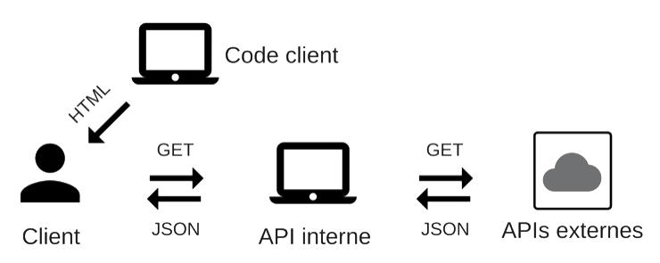

# LiveCity

---

## Objectifs

- Recherche d'une ville
- Informations sur une ville
- Météo sur la ville
- Tweets récents sur la ville
- Photos Instagram populaires
- Prochains séances de cinéma

---

## OpenWeatherMap

### Points forts

- Facile à utiliser

### Points faibles

- Températeure minimales et maximales toujours identiques
- Images

**Conclusion** : Module fonctionnel

---

## Google Maps

Recherche d'une ville, localisation de la ville actuelle

- Utilisation d'un module Angular coté client (Angular-Google-Maps)

---

## Wikipédia

<!-- Informations générales -->

### Points forts

- Pas de clé requise

### Points faibles

- Pas beaucoup de documentation / max expliquée
- Les données utiles sont dans un champ
- Données avec balises
- Certaines données non présentes (population)
- Recherche de villes homonymes difficile

**Conclusion** : Fonctionnel mais lent à utiliser & bugs & évolution non possible

---

## Twitter

<!-- Affichage des tweets -->

### Points forts

- Facile à  utiliser
- Documentation complète

### Points faibles

- Uniquement les tweets le plus récents

**Conclusion** : Fonctionne comme prévu

---

## Instagram

<!-- Affichage de photos à partir d'une recherche de la ville -->

### Points faibles

- Sandbox obligatoire, l'application doit être validé par Instagram
- Interdiction d'afficher des résultats de recherche

**Conclusion** : Module non fonctionnel

---

## Cinéma

- Pas d'API complète & gratuite
- Google ne propose d'API pour leurs données :
  + parser l'HTML
  + techniquement interdit
  + dépendant des évolutions futures

**Conclusion** : Module non fonctionnel

---

# Architecture

Clés API privées, ne peuvent pas être communiquées au client.
